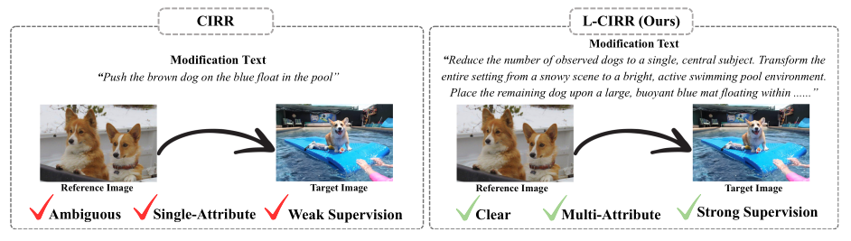

# Beyond Single Sentences: Composed Image Retrieval with Long-Form Modification Texts

<p align="center">
  <b>Junyeong Jang</b> &nbsp;·&nbsp; <b><a href="https://sungonce.github.io/">Seongwon Lee</a></b><sup>*</sup><br>
  School of Electrical Engineering, Kookmin University<br>
  <sub><sup>*</sup>Corresponding author</sub>
</p>

<p align="center">
  <a href="#"></a>
  <a href="#"></a>
  <a href="#"></a>
  <a href="#license"></a>
</p>

<p align="center">
  
</p>

> Comparison between a conventional CIR benchmark (CIRR) and our proposed benchmark (**L-CIRR**) for the same image pair. Existing benchmarks provide only a brief, ambiguous, single-attribute text with weak supervision, while L-CIRR provides a long, detailed modification text that clearly describes multiple fine-grained visual changes.

---

## Abstract

Existing Composed Image Retrieval (CIR) datasets rely on short, single-sentence modification texts. Such texts are often ambiguous and provide insufficient descriptions of compound visual changes, resulting in limited supervision for learning fine-grained image–text composition. To address this limitation, we introduce **L-CIRR**, a new benchmark built on CIRR that provides long, detailed modification texts for each image pair. We further propose **PACE** (**P**rogressive text **A**ccumulation for **C**omposed image r**E**trieval), a retrieval framework designed to effectively exploit this richer supervision through two key components: (1) *progressive text accumulation*, which incrementally integrates textual information sentence by sentence to construct increasingly discriminative query representations, and (2) *multi-step hard negative mining*, which exploits the intermediate embeddings from each accumulation step to mine hard negatives. Extensive experiments demonstrate that PACE, trained with the fine-grained supervision of L-CIRR, consistently outperforms existing methods on both fine-grained and general-purpose retrieval benchmarks while remaining robust to substantial variations in modification text length.

## Highlights

- **L-CIRR** — the first benchmark for *long-form* composed image retrieval, extending CIRR with multi-sentence modification texts generated by Gemini-2.5-Flash while preserving the original image pairs and benchmark protocol.
- **PACE** — a retrieval framework that progressively accumulates textual information sentence by sentence with shared-weight text accumulators, instead of compressing the whole text into a single representation.
- **Multi-Step Hard Negative Mining (MHNM)** — mines hard negatives from the intermediate query embedding of *every* accumulation step, capturing negatives at multiple levels of textual granularity.
- **State-of-the-art** results on both L-CIRR and CIRR, and robust to large variations in modification text length.

## Dataset: L-CIRR

| Dataset | Data Type | Tools Used | Avg Length | Avg Attribute | Avg Object | Avg Unique Token |
|:--|:--|:--|--:|--:|--:|--:|
| FashionIQ | Synthetic | – | 11.9 | 2.9 | 2.3 | 9.5 |
| CIRCO | Real-world | SEARLE | 10.5 | 0.9 | 2.4 | 9.7 |
| CIRR | Real-world | AMT | 11.8 | 1.1 | 3.5 | 11.0 |
| **L-CIRR (Ours)** | Real-world | Gemini-2.5-Flash | **113.7** | **21.5** | **27.5** | **76.7** |

L-CIRR provides **train** and **val** splits (the CIRR test set does not publicly release ground-truth target annotations, so a test split could not be constructed). Modification texts contain 2–10 sentences, peaking at 6 sentences in both splits.

## Results

**Performance comparison on L-CIRR and CIRR.** All methods use BLIP-2 as the backbone and are trained on the L-CIRR training set.

| Method | L-CIRR R@1 | L-CIRR R@5 | L-CIRR R<sub>s</sub>@1 | CIRR R@1 | CIRR R@5 | CIRR R@10 | CIRR R@50 | CIRR R<sub>s</sub>@1 | CIRR R<sub>s</sub>@2 | CIRR R<sub>s</sub>@3 |
|:--|--:|--:|--:|--:|--:|--:|--:|--:|--:|--:|
| CaLa (SIGIR'24) | 80.32 | 97.39 | 92.44 | 39.21 | 69.49 | 80.17 | 94.41 | **71.64** | 87.83 | 94.75 |
| SPRC (ICLR'24) | 87.66 | 98.92 | 95.21 | 39.93 | 70.70 | 81.23 | **95.08** | 70.29 | 87.01 | 94.41 |
| QuRe (ICML'25) | 85.86 | 98.78 | 94.59 | 37.40 | 69.06 | 79.49 | 94.84 | 63.64 | 83.33 | 92.72 |
| TME (CVPR'25) | 85.46 | 98.83 | 94.95 | 37.76 | 67.98 | 78.24 | 93.83 | 67.69 | 85.35 | 93.66 |
| **PACE (Ours)** | **88.35** | **99.26** | **96.10** | **40.82** | **71.64** | **81.25** | 94.84 | 71.42 | **87.88** | **95.06** |

**Impact of long-form text supervision.** Simply replacing CIRR's short texts with L-CIRR's long-form texts (identical image pairs, identical architectures) yields large gains:

| Method | CIRR R@1 | L-CIRR R@1 | Δ R@1 |
|:--|--:|--:|--:|
| SPRC | 51.97 | 87.66 | **+35.69** |
| QuRe | 53.22 | 85.86 | **+32.64** |

**Ablation (trained on L-CIRR).**

| PTA | MHNM | L-CIRR R@1 | L-CIRR R@5 | L-CIRR R<sub>s</sub>@1 | CIRR R@1 |
|:--:|:--:|--:|--:|--:|--:|
| | | 71.68 | 94.71 | 89.19 | 34.94 |
| ✓ | | 74.53 | 95.60 | 91.82 | 37.06 |
| ✓ | ✓ | **88.35** | **99.26** | **96.10** | **40.82** |

## Installation

```bash
git clone https://github.com/<user>/PACE.git
cd PACE

conda create -n pace python=3.10 -y
conda activate pace
pip install -r requirements.txt
```

## Data Preparation

1. Download the CIRR images following the [official CIRR repository](https://github.com/Cuberick-Orion/CIRR).
2. Download the L-CIRR long-form modification texts and place them under `data/L-CIRR/`.

```
data/
└── L-CIRR/
    ├── images/                  # CIRR images (symlink is fine)
    ├── lcirr_train.json         # long-form modification texts (train)
    ├── lcirr_val.json           # long-form modification texts (val)
    └── image_splits/
```

## Training

```bash
python train.py --config configs/pace_lcirr.yaml
```

## Evaluation

```bash
# L-CIRR validation set
python eval.py --config configs/pace_lcirr.yaml --ckpt checkpoints/pace_lcirr.pth --dataset lcirr

# CIRR test set (submission file for the evaluation server)
python eval.py --config configs/pace_lcirr.yaml --ckpt checkpoints/pace_lcirr.pth --dataset cirr
```

## Implementation Details

- The image encoder, multimodal encoder, and text accumulators are initialized from pretrained **BLIP-2**; ViT is initialized from **CLIP-L**.
- Input images are resized to 224×224 with a padding ratio of 1.25.
- **AdamW**, batch size 32, 70 epochs, cosine LR schedule with initial LR 1e-5.
- Learnable temperature τ initialized at 0.07.
- Multi-step hard negative mining is performed periodically every 7 epochs.
- All experiments run on a single **NVIDIA L40S** GPU.

## Citation

```bibtex
@inproceedings{jang2026beyond,
  title     = {Beyond Single Sentences: Composed Image Retrieval with Long-Form Modification Texts},
  author    = {Jang, Junyeong and Lee, Seongwon},
  booktitle = {Proceedings of the Asian Conference on Computer Vision (ACCV)},
  year      = {2026}
}
```

## Acknowledgments

This work was supported by the National Research Foundation of Korea (NRF) grants funded by the Korea government (MSIT) (No. RS-2026-25497410, No. RS-2026-25522067), and by the Institute of Information & Communications Technology Planning & Evaluation (IITP) grant funded by the Korea government (MSIT) (No. RS-2025-02219317, AI Star Fellowship, Kookmin University).

Our implementation builds upon [BLIP-2](https://github.com/salesforce/LAVIS), [CIRR](https://github.com/Cuberick-Orion/CIRR), and [SPRC](https://github.com/chunmeifeng/SPRC).

## License

This project is released under the MIT License. See [LICENSE](LICENSE) for details.
