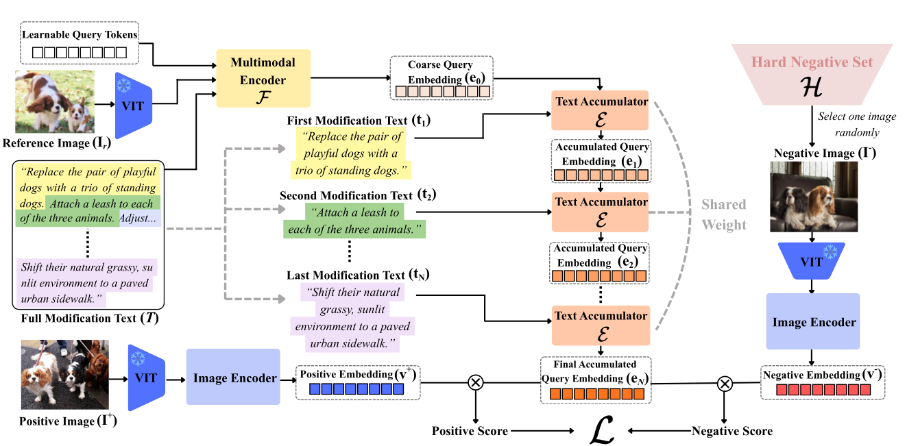

<h1 align="center">Beyond Single Sentences:<br>Composed Image Retrieval with Long-Form Modification Texts</h1>

<p align="center">
  <b>Junyeong Jang</b> &nbsp;·&nbsp; <b><a href="https://sungonce.github.io/">Seongwon Lee</a></b><sup>*</sup><br>
  School of Electrical Engineering, Kookmin University<br>
  <sub><sup>*</sup>Corresponding author</sub>
</p>

<p align="center">
  <a href="#"></a>
  <a href="#"></a>
  <a href="#license"></a>
</p>

<p align="center">
  🎉 <b>Accepted to ACCV 2026</b> (Asian Conference on Computer Vision)
</p>

<p align="center">
  
</p>

> Comparison between a conventional CIR benchmark (CIRR) and our proposed benchmark (**L-CIRR**) for the same image pair. Existing benchmarks provide only a brief, ambiguous, single-attribute text with weak supervision, while L-CIRR provides a long, detailed modification text that clearly describes multiple fine-grained visual changes.

---

## Abstract

Existing Composed Image Retrieval (CIR) datasets rely on short, single-sentence modification texts. Such texts are often ambiguous and provide insufficient descriptions of compound visual changes, resulting in limited supervision for learning fine-grained image–text composition. To address this limitation, we introduce **L-CIRR**, a new benchmark built on CIRR that provides long, detailed modification texts for each image pair. We further propose **PACE** (**P**rogressive text **A**ccumulation for **C**omposed image r**E**trieval), a retrieval framework designed to effectively exploit this richer supervision through two key components: (1) *progressive text accumulation*, which incrementally integrates textual information sentence by sentence to construct increasingly discriminative query representations, and (2) *multi-step hard negative mining*, which exploits the intermediate embeddings from each accumulation step to mine hard negatives. Extensive experiments demonstrate that PACE, trained with the fine-grained supervision of L-CIRR, consistently outperforms existing methods on both fine-grained and general-purpose retrieval benchmarks while remaining robust to substantial variations in modification text length.

## Framework

<p align="center">
  
</p>

> Overview of **PACE**. The reference image and full modification text are fed into the multimodal encoder to produce a coarse query embedding, which is progressively enriched with increasingly detailed textual information sentence by sentence through a stack of shared-weight text accumulators. The resulting final accumulated query embedding is optimized to distinguish the positive target from hard negative images.

## L-CIRR Dataset

🚧 **Coming soon.** The long-form modification texts for the L-CIRR train / val splits will be released here.

## Code

🚧 **Coming soon.** Training and evaluation code for PACE will be released here.

## Citation

```bibtex
@inproceedings{jang2026beyond,
  title     = {Beyond Single Sentences: Composed Image Retrieval with Long-Form Modification Texts},
  author    = {Jang, Junyeong and Lee, Seongwon},
  booktitle = {Proceedings of the Asian Conference on Computer Vision (ACCV)},
  year      = {2026}
}
```

## Acknowledgments

This work was supported by the National Research Foundation of Korea (NRF) grants funded by the Korea government (MSIT) (No. RS-2026-25497410, No. RS-2026-25522067), and by the Institute of Information & Communications Technology Planning & Evaluation (IITP) grant funded by the Korea government (MSIT) (No. RS-2025-02219317, AI Star Fellowship, Kookmin University).

## License

This project is released under the MIT License. See [LICENSE](LICENSE) for details.
